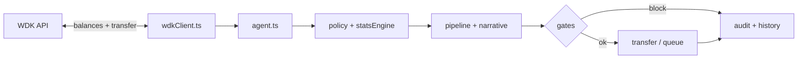

# StablePilot — Pitch / video slides (English)

Copy each block into **Google Slides**, **PowerPoint**, **Canva**, or **Gamma**. Keep **large type** (≥ 28 pt body), **high contrast**, and **one idea per slide**. For the demo video, use the **Video beat** line as your narration cue.

**Brand:** dark background `#0c0f14`, accent `#3b82f6` or mint `#34d399`, monospace for code paths.

---

## Slide 1 — Title

**StablePilot**  
*Treasury Governance OS — WDK + governed autonomy*

Subtitle: Galactica / WDK Hackathon · [Team name]

**Visual:** Logo or wordmark + small “USDT · Policy · Audit” chips.

**Video beat (0:00–0:15):** “We built StablePilot — treasury automation with receipts, not vibes.”

---

## Slide 2 — The problem

**Manual treasuries don’t scale**

- Balance checks and transfers are **reactive** and **error-prone**
- Liquidity gaps break **payroll, vendors, and protocol ops**
- “AI chat” agents lack **reproducible math** and **audit trails** compliance needs

**Visual:** Split: chaos icons (spreadsheets, alerts) vs. question “Why was this transfer executed?”

**Video beat:** Pain in one sentence; don’t linger.

---

## Slide 3 — Who it’s for

**Built for real operators**

- DAO treasurers & multisig admins  
- Fintech / payment ops with **stablecoin** floats  
- Any team that needs **governed autonomy** on a **WDK-connected** wallet

**Visual:** Three short labels with icons.

---

## Slide 4 — Solution (one line)

**StablePilot closes the loop**

Read balance (**WDK**) → **statistics + policy** → **narrative + execution gate** → **persisted audit**  
Optional **human approval** before funds move.

**Visual:** Simple left-to-right flow (4 boxes). Label the last box “WDK transfer”.

**Video beat (0:25–1:00):** Four-layer pipeline in plain language.

---

## Slide 5 — Four-layer pipeline (detail)

| Layer | Role |
|--------|------|
| **Rules** | Thresholds, presets (conservative / balanced / aggressive) |
| **Drift stats** | Z-score style signals on balance **flow** (SPC-style) |
| **Narrative** | Deterministic explanation of the decision |
| **Execution** | Autonomous **or** approval queue + caps / cooldown |

**Visual:** Stack diagram; highlight “same inputs → same outputs” for audit.

---

## Slide 6 — WDK integration (judges care)

**Real wallet integration — not a mock UI**

- `GET …/wallets/{id}/balances` — read USDT snapshot  
- `POST …/wallets/{id}/transfer` — execute bounded USDT transfer  
- **`SIMULATION_MODE`** for safe public demos without live keys  
- Code: `galactica-agent/src/integrations/wdkClient.ts`

**Visual:** Two API bullets + file path in monospace.

**Video beat (3:15–4:25):** Show 5–10 s of `wdkClient.ts` or split screen code + dashboard.

---

## Slide 7 — Safety & economics

**Designed to fail safe**

- Per-tx **cap**, **cooldown**, optional **daily USDT budget**  
- **Circuit breaker** — global stop on outbound transfers  
- **Strict governance** — optional block on extreme \|z\|  
- **Maintenance freeze** — evaluate policy without executing

**Visual:** Shield + three short bullets.

---

## Slide 8 — Auditability & ops

**Prove it — don’t claim it**

- Persisted history · CSV / JSON exports  
- **`/audit/bundle`**, **`/policy/fingerprint`**, **`/attestation/snapshot`**  
- **SSE** ops stream · **`/metrics`** (Prometheus) · **OpenAPI**  
- **80+ HTTP routes** — `GET /api/routes`

**Visual:** One row of endpoint chips (mock UI).

---

## Slide 9 — Live demo plan (for recording)

**What we’ll show in ~2 minutes**

1. Dashboard — health / stability / **Run once**  
2. Preset change → effective policy visible  
3. **Approval mode** → pending queue → approve  
4. **Circuit open** → blocked run → close circuit  
5. Optional: **`[YOUR_LIVE_URL]/briefing/judge`** JSON in browser

**Visual:** Numbered list only (you screen-record over this or skip slide in deck).

**Video beat (1:05–3:15):** Follow this order; narrate “every click is an API.”

---

## Slide 10 — Architecture

**Stack**

- **Node 20 · TypeScript · Express** — `src/server.ts`  
- **Agent core** — `src/agent.ts`  
- **Static dashboard** — `public/index.html`  
- **Deploy:** Docker + Render (or self-hosted)

**Visual:** Simple boxes: Client → API → Agent → WDK.

---

## Slide 11 — Links (for judges)

**Try it**

- **Repo:** https://github.com/thanhphucvnu/StablePilot  
- **Live demo:** `[YOUR_HTTPS_URL]` ← paste Render (or other) URL  
- **Health check:** `[YOUR_HTTPS_URL]/health`  
- **Judge JSON:** `[YOUR_HTTPS_URL]/briefing/judge`

**Visual:** QR codes optional (repo + live) for live pitch.

**Video beat (4:55–5:00):** Read URL slowly; mention repo path `submission/` for form text.

---

## Slide 12 — Team & closing

**[Team name] · [City, country]**

- [Name] — [role]  
- [Name] — [role]

**Thank you / Questions**  
*StablePilot — autonomy with receipts.*

**Video beat:** Smile, hold final frame 2 s.

---

## Optional — one-slide “architecture” diagram (Mermaid)

Paste into [Mermaid Live](https://mermaid.live) → export PNG for a slide.

---

## Optional — Marp (VS Code “Marp for VS Code”)

If you use Marp, create a new file and split slides with `---` after a frontmatter block; the content above maps 1:1 to slides.
